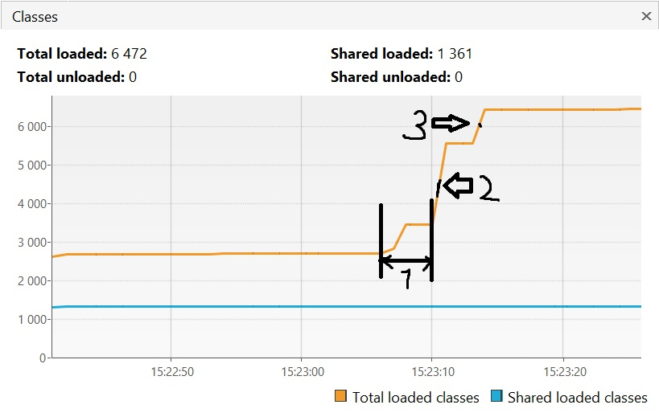
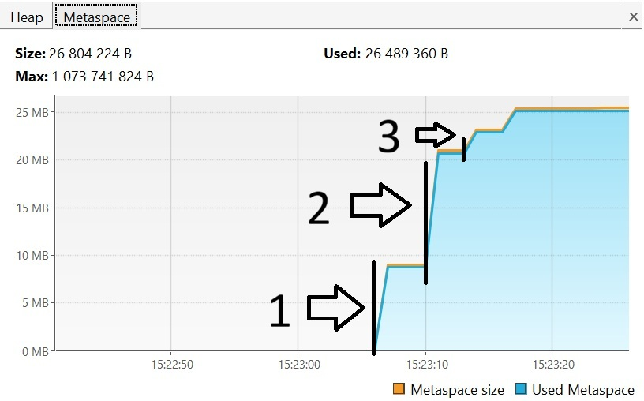
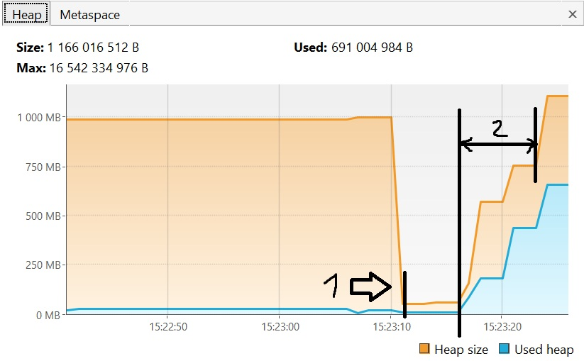

# Отчет об исследовании работы JVM через VisualVM

## 1. Анализ загрузки классов (Classes & Metaspace)

Согласно логам, активная загрузка внешних библиотек началась через 30 секунд после старта программы.

1. **15:23:06 — 15:23:07**: Загрузка `io.vertx` (+529 классов). На графиках **Classes** (отметка 1) и **Metaspace** (отметка 1) видна первая "ступенька" роста.
2. **15:23:10**: Загрузка `io.netty` (+2117 классов). Это вызвало самый резкий скачок (отметка 2 на обоих графиках).
3. **15:23:13**: Загрузка `org.springframework` (+869 классов). Итоговое количество классов достигло **6 472** (отметка 3).

* **Итог Metaspace**: Область Metaspace выросла до **~26.5 МБ** для хранения структур всех загруженных классов.

## 2. Анализ кучи (Heap)

На графике Heap наблюдаются две фазы: автоматическая оптимизация и интенсивное наполнение объектами.

1. **Фаза оптимизации (15:23:10)**: На графике заметно резкое падение **Heap Size** (отметка 1). JVM проанализировала, что зарезервированный объем избыточен для приложения в режиме ожидания, и уменьшила его.
2. **Фаза наполнения (15:23:16 — 15:23:23)**: В зоне под отметкой 2 происходило создание объектов:

* **1-я итерация**: Создание 5 млн объектов. Синяя линия (**Used heap**) резко идет вверх.
* **2-я итерация**: Еще 5 млн объектов. JVM начинает увеличивать **Heap Size** (оранжевая линия), так как лимит памяти почти исчерпан.
* **3-я итерация**: Последние 5 млн объектов. Потребление памяти достигает пика в **~691 МБ**.

## 3. Таблица соответствия событий лога и графиков

| Время | Сообщение в консоли | Влияние на графики в VisualVM |
| :--- | :--- | :--- |
| **15:23:06** | `loading io.vertx` | Начало роста графиков Classes и Metaspace. |
| **15:23:10** | `loading io.netty` | Максимальный прирост в Metaspace. Сброс Heap Size до минимума. |
| **15:23:16** | `creating 5000000 objects` | Первый резкий подъем синей линии (Used) на графике Heap. |
| **15:23:20** | `creating 5000000 objects` | Рост Used Heap и расширение Heap Size. |
| **15:23:23** | `creating 5000000 objects` | Достижение пиковых значений по потреблению кучи. |

## Вывод

1. **Metaspace** выделяется под метаданные классов и растет только при их загрузке, оставаясь стабильным при создании объектов.
2. **Heap** — динамическая область. JVM эффективно освобождает неиспользуемое и расширяет пространство при массовом создании новых экземпляров объектов.

